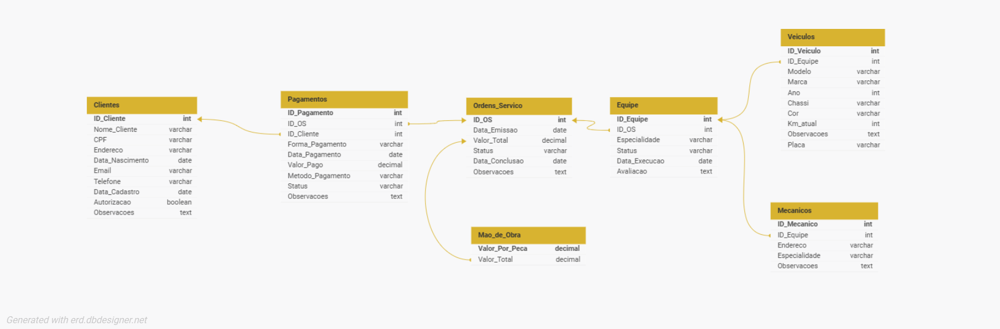

# Projeto Conceitual de Banco de Dados de Controle e Gerenciamento na Execução de Ordens de Serviço Para Uma Oficina Mecânica.

Este repositório apresenta a modelagem conceitual de um banco de dados voltado para o projeto de Controle e Gerenciamento na execução de ordens de serviço para uma Oficina Mecânica, foi desenvolvido como parte do Curso Suzano - Análise de Dados com Power BI na plataforma DIO, sob a orientação da instrutora Juliana Mascarenhas.  

## 📋 Objetivo:
Cria o esquema conceitual para o contexto de oficina com base na narrativa fornecida

## :page_facing_up: Narrativa:
- Sistema de controle e gerenciamento de execução de ordens de serviço em uma oficina mecânica
- Clientes levam veículos à oficina mecânica para serem consertados ou para passarem por revisões  periódicas
- Cada veículo é designado a uma equipe de mecânicos que identifica os serviços a serem executados e preenche uma OS com data de entrega.
- A partir da OS, calcula-se o valor de cada serviço, consultando-se uma tabela de referência de mão-de-obra
- O valor de cada peça também irá compor a OS do cliente autoriza a execução dos serviços
- A mesma equipe avalia e executa os serviços
- Os mecânicos possuem código, nome, endereço e especialidade
- Cada OS possui: n°, data de emissão, um valor, status e uma data para conclusão dos trabalhos.

## 🛠️ Ferramentas Utilizadas  

- **Ferramenta de Modelagem**: [DB Designer](https://erd.dbdesigner.net/))  
- **Plataforma de Estudo**: [DIO - Digital Innovation One](https://web.dio.me/)  

## 📖 Estrutura do Banco de Dados  

O modelo conceitual inclui as seguintes entidades principais:  

1. **Clientes**  
   - Dados Pessoais e Autorização

2. **Pagamentos**  
   - Informações de Pagamento como Valores e Status

3. **Ordens de Serviço**  
   - Informações de Valores, Datas de Emissão e Conclusão 

4. **Equipes**  
   - Informações da Equipe de Mecanicos, Ordem de Serviço, Status, Ordem de Execução

5. **Mão de Obra**
   - Valores por peça e Valor Total

  
*Exemplo do diagrama conceitual*  

## 🚀 Como Visualizar o Modelo  

1. Link: [DB Designer - Controle_OficinaMecanica](https://dbdesigner.page.link/zbK1VTB79DdJbmB69)
3. Explore o modelo conceitual e suas relações.  

## 📚 Referências  

- [DIO - Digital Innovation One](https://web.dio.me/)  
